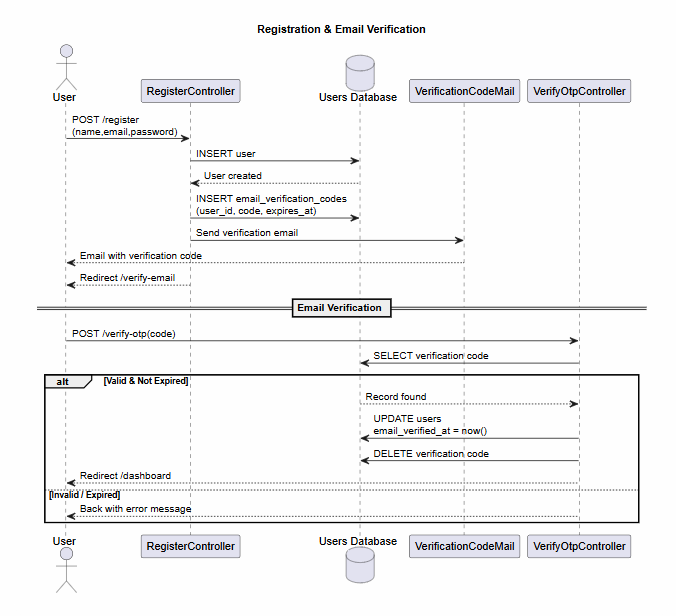
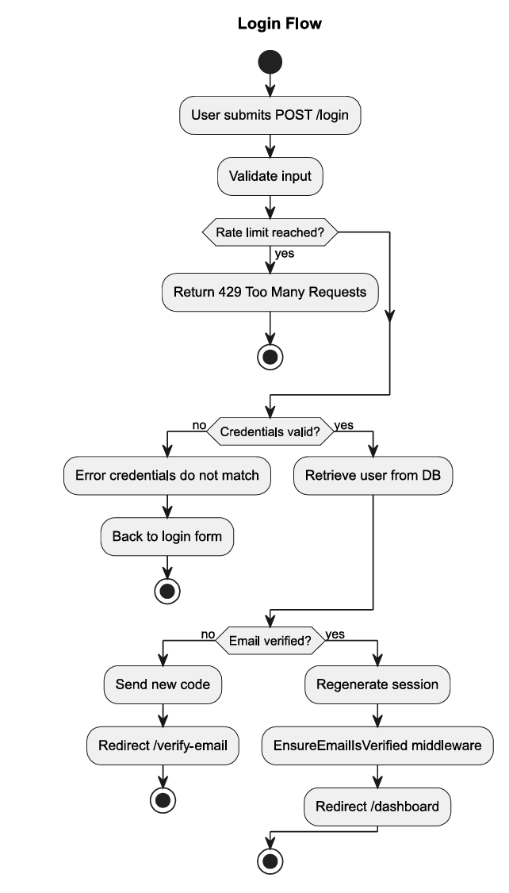
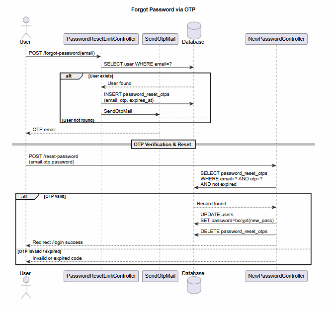
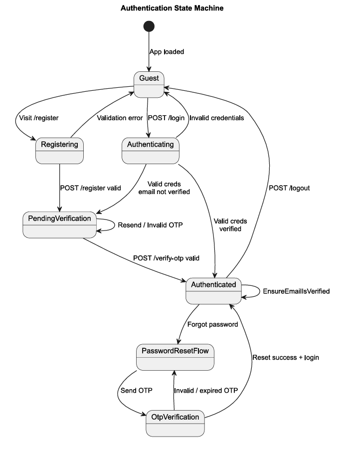

# 📚 Smart Tasks Planner

> A full-featured student productivity platform built with Laravel — combining task management, Pomodoro sessions, flashcards, notes, exam tracking, gamification, and a secure custom authentication system.


---

## 📖 Description

**Smart Tasks Planner** is a Laravel MVP designed specifically for students who want to take control of their academic workflow. It provides a unified platform for organizing study sessions, managing tasks, tracking exam dates, building flashcard decks, and staying motivated through streaks and gamification — all behind a secure, custom-built authentication system with email verification codes and OTP-based password resets.

---

## ✨ Features

### 🔐 Authentication & Security
- User registration and login with enhanced UI
- **Custom email verification** using time-limited numeric codes (not default Laravel links)
- **OTP-based forgot password** — a secure one-time code is sent to the user's email
- Password confirmation and update flows
- `EnsureEmailIsVerified` middleware protecting all authenticated routes
- Full logout functionality with session invalidation

### 🎯 Core Productivity Modules
| Module | Description |
|---|---|
| **Dashboard** | Overview of tasks, streaks, badges, and upcoming exams |
| **Study Tasks** | Create, update, prioritize, and complete academic tasks |
| **Notes** | Rich note-taking per subject |
| **Pomodoro Timer** | Built-in focus sessions with session tracking |
| **Flashcards** | Create and review flashcard decks for active recall |
| **Exams** | Track upcoming exams with dates and subjects |
| **Subjects** | Organize all content by academic subject |
| **User Profile** | Edit personal information and preferences |

### 🏆 Gamification & Motivation
- **Streaks** — daily study streak tracking
- **Badges** — achievement system rewarding consistency
- **GamificationService** — centralized logic for XP and badge attribution

---

## 🛠️ Technologies Used

| Layer | Technology |
|---|---|
| Backend Framework | Laravel 12 (PHP 8.2+) |
| Templating | Blade |
| Auth Scaffolding | Laravel Breeze |
| Database | MySQL  |
| Frontend Styling | Tailwind CSS + Bootstrap 5 |
| Build Tool | Vite |
| Mail | SMTP (configurable — Gmail, Mailtrap, etc.) |
| Auth Extras | Custom OTP / Verification Code Mailers |

---

## ⚙️ Requirements

- PHP **8.2** or higher
- Composer
- Node.js **18+** and npm
- MySQL **8.0+** (or MariaDB)
- XAMPP / Laravel Valet / any local server with Apache/MySQL

---

## 🚀 Installation

### 1. Clone the repository

```bash
git clone https://github.com/your-username/smart-tasks-planner.git
cd smart-tasks-planner
```

### 2. Install PHP dependencies

```bash
composer install
```

### 3. Install Node dependencies & build assets

```bash
npm install
npm run build
```

### 4. Copy and configure the environment file

```bash
cp .env.example .env
php artisan key:generate
```

---

## 🔧 Environment Configuration

Open `.env` and update the following sections:

### App Settings

```env
APP_NAME="SmarTasker"
APP_ENV=local
APP_DEBUG=true
APP_URL=http://127.0.0.1:8000
```

### Database

```env
DB_CONNECTION=mysql
DB_HOST=127.0.0.1
DB_PORT=3306
DB_DATABASE=smart_tasks_planner
DB_USERNAME=root
DB_PASSWORD=
```

### Mail (SMTP — required for email verification & OTP)

```env
MAIL_MAILER=smtp
MAIL_HOST=smtp.gmail.com          # or you can use also smtp.mailtrap.io 
MAIL_PORT=587
MAIL_USERNAME=your@email.com
MAIL_PASSWORD=your_app_password
MAIL_ENCRYPTION=tls
MAIL_FROM_ADDRESS=your@email.com
MAIL_FROM_NAME="SmarTasker"
```

> **Gmail users:** Enable 2-Step Verification and generate an [App Password](https://myaccount.google.com/apppasswords) — use that as `MAIL_PASSWORD`.
>
> **Development:** Use [Mailtrap](https://mailtrap.io) or `MAIL_MAILER=log` to avoid sending real emails.

---

## 🗄️ Database Setup

### Create the database

In phpMyAdmin or your MySQL client:

```sql
CREATE DATABASE smart_tasks_planner CHARACTER SET utf8mb4 COLLATE utf8mb4_unicode_ci;
```

### Run migrations and seeders

```bash
php artisan migrate --seed
```

### (Optional) Create the storage symlink for file uploads

```bash
php artisan storage:link
```

---

## ▶️ Run Locally

### Option A — Laravel development server

```bash
php artisan serve
```

Visit: [http://127.0.0.1:8000](http://127.0.0.1:8000)

### Option B — XAMPP / Apache

Place the project inside `htdocs/`, update `.env`:

```env
APP_URL=http://localhost/smart-tasks-planner/public
```

Visit: [http://localhost/smart-tasks-planner/public](http://localhost/smart-tasks-planner/public)

---

## 🔑 Authentication Flow

The authentication system is fully implemented and covers four scenarios documented in detail below. All routes beyond `/dashboard` (Tasks, Notes, Pomodoro, Flashcards, Exams) are not yet built — diagrams for those modules will be added in a future release.

**Key controllers involved:**

- `RegisteredUserController` — handles registration and user creation
- `EmailVerificationController` + `VerifyOtpController` — code dispatch and OTP validation
- `PasswordResetLinkController` + `NewPasswordController` — OTP generation and password reset
- `EnsureEmailIsVerified` middleware — blocks all dashboard access until email is confirmed

---

## 📐 Authentication Diagrams


Four diagrams cover every authentication scenario currently implemented. The scope intentionally stops at the `/dashboard` redirect — feature modules are not yet coded.

### Diagram 1 — Registration & Email Verification
> *Sequence diagram*

Shows the full lifecycle from `POST /register` through `EmailVerificationCodeMail` dispatch, OTP storage in `email_verification_codes`, and validation in `VerifyOtpController` — including happy path and error path.



---

### Diagram 2 — Login Flow
> *Activity diagram*

Decision tree from credential submission through the `EnsureEmailIsVerified` middleware guard. Covers three terminal states: dashboard access, verify-email redirect, and rate-limit lockout.



---

### Diagram 3 — Forgot Password via OTP
> *Sequence diagram*

Two-phase OTP reset: `POST /forgot-password` dispatches `SendOtpMail` and inserts a timed record; `POST /reset-password` validates the code, updates the bcrypt hash, and removes the OTP row. Email enumeration is prevented by returning the same response regardless of whether the address exists.



---

### Diagram 4 — Authentication State Machine
> *State diagram*

Maps every session state a user can occupy (Guest → Registering → PendingVerification → Authenticated, plus the PasswordResetFlow branch) and the transitions enforced by the application and its middleware.



---

## 🎥 Demo Videos

> Demo videos of the implemented authentication workflows.


### 1️⃣ Registration & Email Verification

[▶ Watch Registration Demo](https://drive.google.com/file/d/1HcnEnr9TKq6Er__Cvp7YLnFvTdEVeE1Z/view?usp=sharing)

Covers:
- User registration
- Verification email
- OTP verification
- Dashboard access

---

### 2️⃣ Forgot Password → Reset Password → Login → Logout

[▶ Watch Password Reset Demo](https://drive.google.com/file/d/1IYufrJ1YU73GJOOI8vgWTNAgXbycI7Qj/view?usp=sharing)

Covers:
- Forgot password
- OTP reset
- Password reset
- Login
- Logout

## 🗂️ Project Structure (Key Files)

```
app/
├── Http/
│   ├── Controllers/
│   │   ├── Auth/                  # All auth controllers (OTP, email verify, login…)
│   │   ├── DashboardController.php
│   │   ├── TaskController.php
│   │   ├── NoteController.php
│   │   ├── PomodoroController.php
│   │   ├── FlashcardController.php
│   │   ├── ExamController.php
│   │   └── SubjectController.php
│   └── Middleware/
│       └── EnsureEmailIsVerified.php
├── Mail/
│   ├── EmailVerificationCodeMail.php   # Sends verification code on register
│   └── SendOtpMail.php                 # Sends OTP for password reset
├── Models/
│   ├── User.php
│   ├── Task.php, Note.php, Flashcard.php, Exam.php, Subject.php
│   ├── PomodoroSession.php
│   ├── Streak.php, Badge.php
│   ├── EmailVerificationCode.php
│   └── PasswordResetOtp.php
└── Services/
    └── GamificationService.php         # XP, streaks, badge logic
```

---

## 🔮 Future Improvements

- [ ] **AI Study Assistant** — suggest flashcard topics or study schedules based on task history
- [ ] **Collaborative Notes** — share notes with classmates in real time
- [ ] **Calendar Integration** — sync exams and tasks with Google Calendar
- [ ] **Mobile App** — React Native or Flutter companion app using a Laravel API backend
- [ ] **Dark Mode** — full dark/light theme toggle
- [ ] **Push Notifications** — browser notifications for Pomodoro sessions and upcoming exams
- [ ] **Analytics Dashboard** — weekly/monthly productivity reports with charts
- [ ] **Two-Factor Authentication (2FA)** — TOTP-based 2FA as an additional login layer
- [ ] **OAuth Login** — Sign in with Google / GitHub

---

## 📄 License

This project is open source and available under the [MIT License](LICENSE).

---

## 👨‍💻 Author

Developed as a student productivity and academic task management platform using the Laravel framework.

> Feel free to fork, star ⭐, and contribute!
